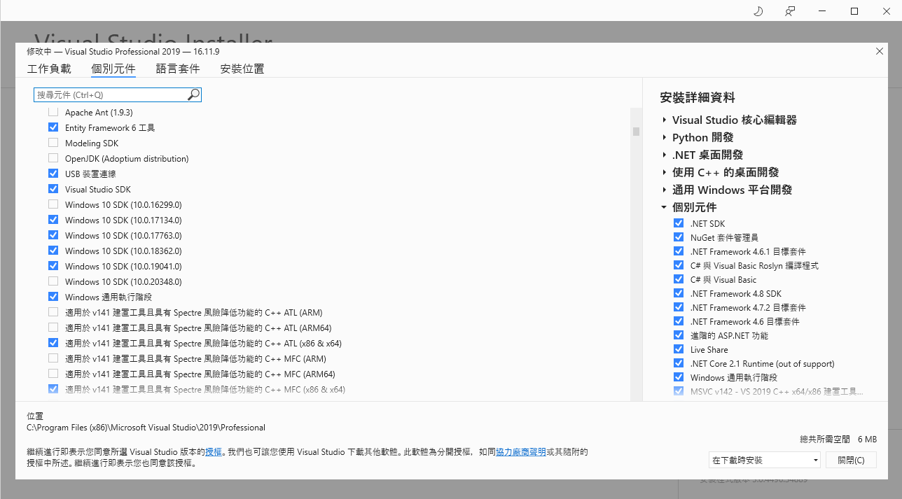
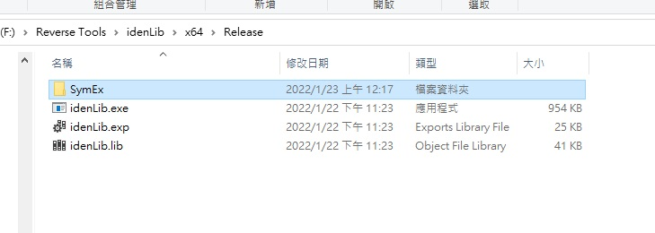
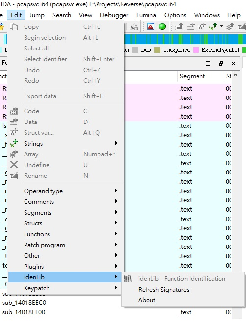
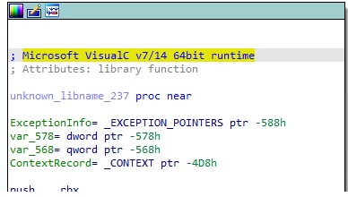
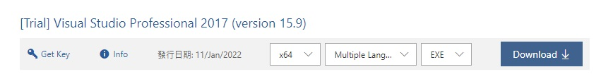
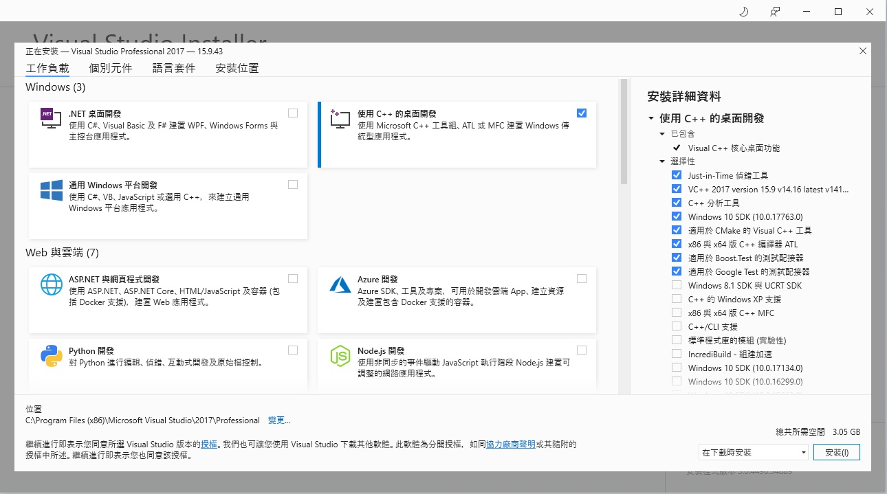

# idenLib.py

[`idenLib`](https://github.com/secrary/idenLib) (Library Function Identification ) plugin for `IDA Pro`


## Getting Started
When analyzing malware or 3rd party software, it's challenging to identify statically linked libraries and to understand what a function from the library is doing.

[`idenLib.exe`](https://github.com/secrary/idenLib) is a tool for generating library signatures from `.lib`/`.obj`/`.exe` files.

[`idenLib.dp32`/`idenLib.dp64`](https://github.com/secrary/idenLibX) is a [`x32dbg`/`x64dbg`](https://x64dbg.com) plugin to identify library functions.

[`idenLib.py`](https://github.com/secrary/IDA-scripts/tree/master/idenLib) is an [`IDA Pro`](https://www.hex-rays.com/products/ida/index.shtml) plugin to identify library functions.

### Prerequisites
下載 [`idenLib`](https://github.com/secrary/idenLib) 專案，用 `GitHub Desktop` 會一併下載[`zstd @ 197a573`](https://github.com/facebook/zstd/tree/197a5737c87730470213d8d3ee6a3fbbd712ba5b) 和 [`zydis @ f4431f2`](https://github.com/zyantific/zydis/tree/f4431f2d78fdd8f15e5fa0a55fa3ca800742476a) 相依函數庫

### Build
編譯需要用到`Windows SDK`，使用 [`Visual Studio Installer`](https://visualstudio.microsoft.com/zh-hant/downloads/)安裝


- open `zstd` with Visual Studio and build it use  `x64` `Release` mode.
    >PATH:  {idenLib project}\idenLib\dependencies\zstd\build\VS2010\zstd.sln

- open `zydis` with Visual Studio and build it use  `x64` `Release` mode.
    >PATH:  {idenLib project}\idenLib\dependencies\zydis\msvc\Zydis.sln

- open `idenLib` with Visual Studio and build it use  `x64` `Release` mode.
    >PATH:  {idenLib project}\idenLib.sln

### Generate
- Generate library signatures: `idenLib.exe` /path/to/file or idenLib.exe /path/to/directory
- Generate main function signature: `idenLib.exe` /path/to/pe -getmain

### Usage
- Copy the plugin under [`idenLib.py`](idenLib.py) to `%IDA_DIR%\plugins` folder
- Copy signatures under `SymEx` to `%IDA_DIR%` folder
- Install dependencies: `zstd` and `capstone` 
    ```bash
    pip3 install zstd capstone
    ```
- refresh signatures

    
### Example
1. IDA pro show `unknown_libname_XXX`  and tell Microsoft VisualC v7/14 64bit runtime
    
2. Generate library signatures: 
    ```bash
    idenLib.exe "C:\Program Files (x86)\Microsoft Visual Studio\2017\Professional\VC\Tools\MSVC\14.16.27023\lib\x64"
    idenLib.exe "C:\Program Files (x86)\Microsoft Visual Studio\2017\Professional\VC\Tools\MSVC\14.16.27023\atlmfc\lib\x64"
    idenLib.exe "C:\Program Files (x86)\Microsoft Visual Studio\2017\Professional\VC\Auxiliary\VS\lib\x64"
    idenLib.exe "C:\Program Files (x86)\Windows Kits\10\lib\10.0.20348.0\ucrt\x64"
    idenLib.exe "C:\Program Files (x86)\Windows Kits\10\lib\10.0.20348.0\um\x64"
    idenLib.exe "C:\Program Files (x86)\Windows Kits\NETFXSDK\4.8\lib\um\x64"
    ```
3. Find signatures `SymEx` folder:

    
### Visual Studio 2017
* [Visual Studio 2017 Subscriptions](https://my.visualstudio.com/Downloads?q=visual%20studio%202017&wt.mc_id=o~msft~vscom~older-downloads)

* Choose Desktop development with C++ 

* [Microsoft Visual C++ 可轉散發套件最新支援的下載](https://docs.microsoft.com/zh-tw/cpp/windows/latest-supported-vc-redist?view=msvc-170)